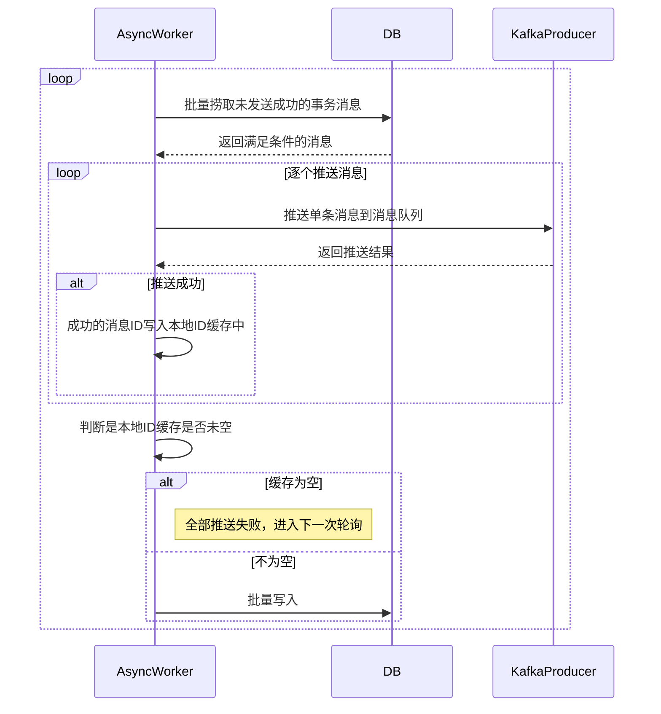

# local_message_table
基于Go封装的分布式事务本地消息表方案，本地消息表的异步补偿机制逻辑如下：

```mermaid
    sequenceDiagram
        participant AsyncWorker
        participant DB
        participant KafkaProducer
        
        loop
            AsyncWorker ->> DB: 批量捞取未发送成功的事务消息
            DB -->> AsyncWorker: 返回满足条件的消息
            loop 逐个推送消息
                AsyncWorker ->> KafkaProducer: 推送单条消息到消息队列
                KafkaProducer -->> AsyncWorker: 返回推送结果
                alt 推送成功
                    AsyncWorker ->> AsyncWorker: 成功的消息ID写入本地ID缓存中
                end
            end
            
            AsyncWorker ->> AsyncWorker: 判断是本地ID缓存是否未空
            alt 缓存为空
                note right of AsyncWorker: 全部推送失败，进入下一次轮询
            else 不为空
                AsyncWorker ->> DB: 批量写入
            end
        end
        
```